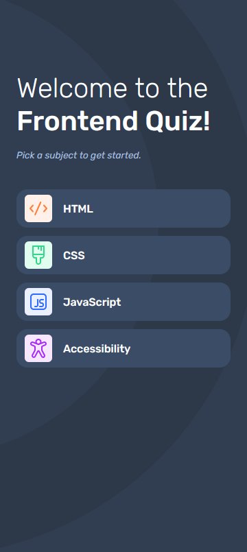
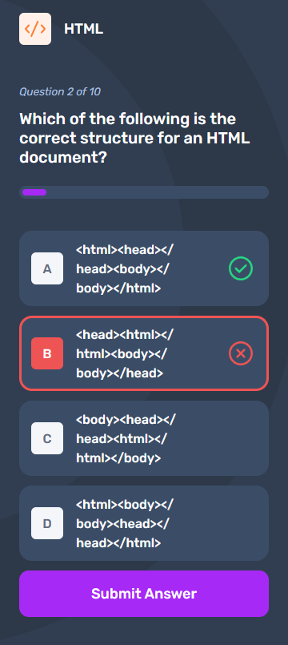

# Frontend Quiz

Check out the [live implementation here](https://frontend-quiz-rickydodd.vercel.app/), spun up by [Vercel](https://vercel.com/).

## What is Frontend Mentor?

[Frontend Mentor](https://www.frontendmentor.io/) is a website that offers a variety of coding challenges to help sharpen HTML, CSS, and JavaScript skills, and skills related to tools that either leverage or abstract front-end concerns. This challenge is the [Frontend Quiz app](https://www.frontendmentor.io/challenges/frontend-quiz-app-BE7xkzXQnU).

## What did Frontend Mentor provide?

- Figma design files (the design specifications)
- Design system for colours, fonts, etc
- Image assets
- JSON data file (the questions and answers for the quiz)

## Current State of Frontend Quiz

### Mobile View Screenshots

All of the following screenshots are using the dark mode implementation of my web application. While I have not yet added a toggle for light mode and dark mode, the current implementation of my web application does have both distinct modes implemented and uses the browser set mode.

Home Screen

Quiz (No Option Selected, but Attempted to Submit)

Quiz (Correct Answer Submitted)

Quiz (Incorrect Answer Submitted)

Quiz Complete Screen

### State Checklist

- [x] Fully functional.
- [x] Mobile style implementation.
- [ ] Tablet style implementation.
- [ ] Desktop style implementation.

## Introspection

### Changes to the `data.json` File

#### The Problem

In the design specification, it shows that each icon has a unique background colour. This colour is absent from the svg images.

#### My Solution

There are multiple ways in which this could have been solved. Several hard-coded approaches, such as setting individual icon colours in the TailwindCSS config, giving each link a class that correlates with their slug, etc, were easy to think of. But I chose to make it more dynamic.

I instead opted for having a fallback background colour for icons, but extracting the unique colour for each icon from the `data.json` file. If this data were dynamic, then the quiz could be extended more trivially and without alteration to the TailwindCSS config, HTML, CSS, etc. This meant adding the colours to the `data.json` file.

If the data contained in `data.json` were retrieved from an external API, and thus I had no control over what it contained, then an alternative would be creating a parity internal API that would associate an icon with an icon background colour.

### Background Image

#### The Problem

While it seems like the background used in the mobile design is achievable with purely CSS, the tablet design and desktop design seem like they will require rotating an element.

#### My Solution

I decided that the solution is adding two absolutely positioned elements in the HTML. Due to these being purely decorative, for accessibility purposes they should be hidden from the accessibility tree. Just one of the elements will be sufficient for the mobile and tablet designs, while the desktop design will require both elements.

### Progress Bars

#### The Problem

Support for browser-native progress bars seems extremely scattered.

#### My Solution

My own implementation of a progress bar that makes use of aria tools. I created a progress bar component.

### Generating the Slug

#### The Problem

As dynamic routing will be required to generate the pages from the local data file, slugs need to be generated.

#### My Solution

I chose to use the title as the slug. To do so, I chose simply to make the title lowercase and that is it. Depending on future data, this would be insufficient for generating slugs. For example, say we want to extend the quiz to front-end and back-end matters, and we want to add a quiz for React Query. Well, making it lowercase results in `react query`, with a space. A string containing a space is not a valid slug.
